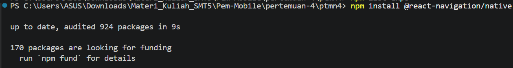
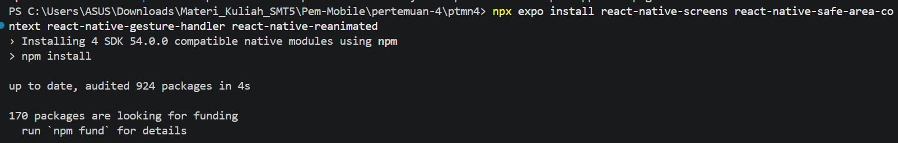
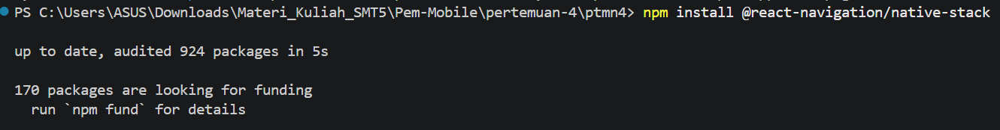
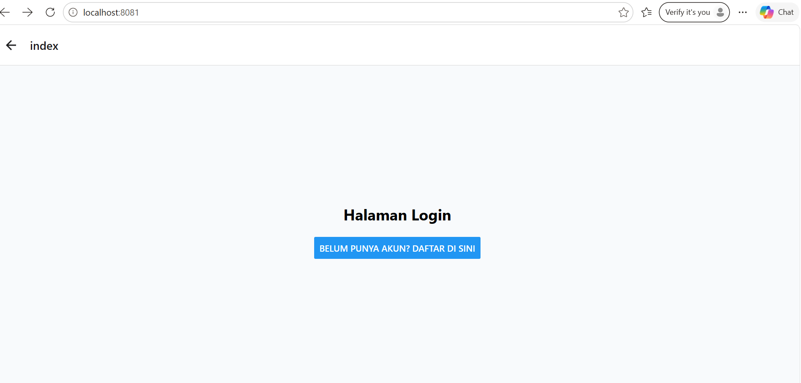
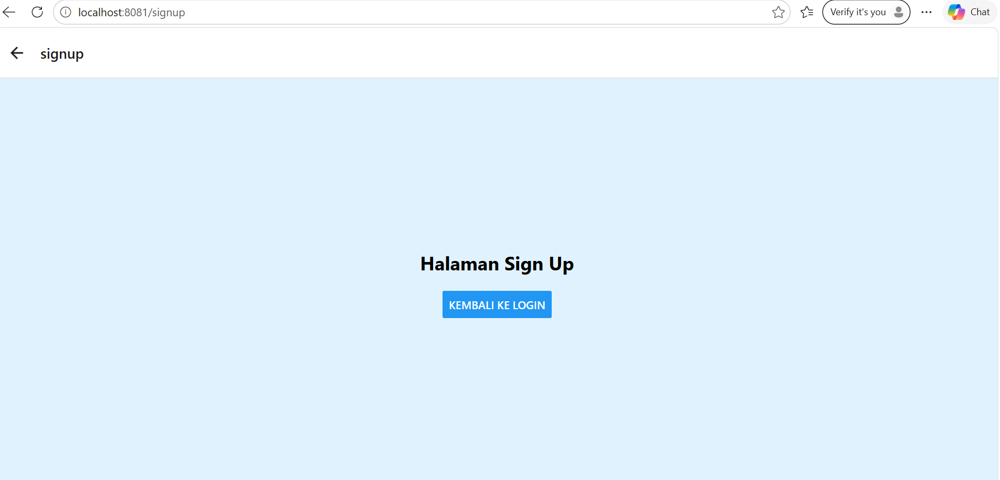
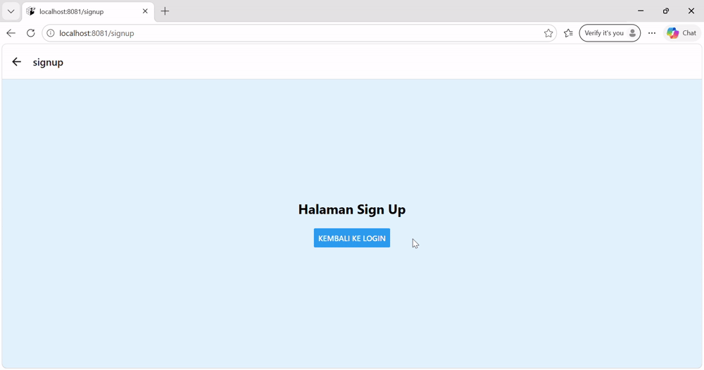
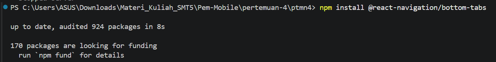
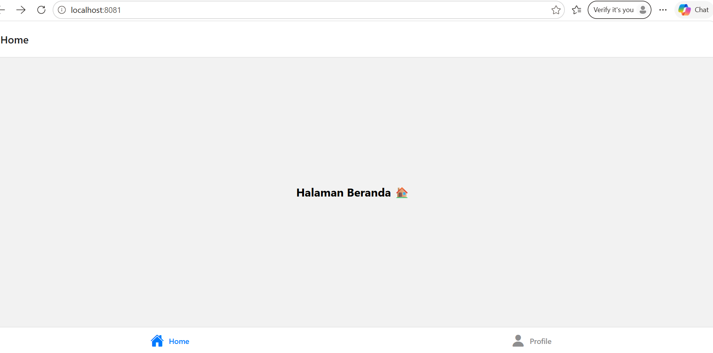
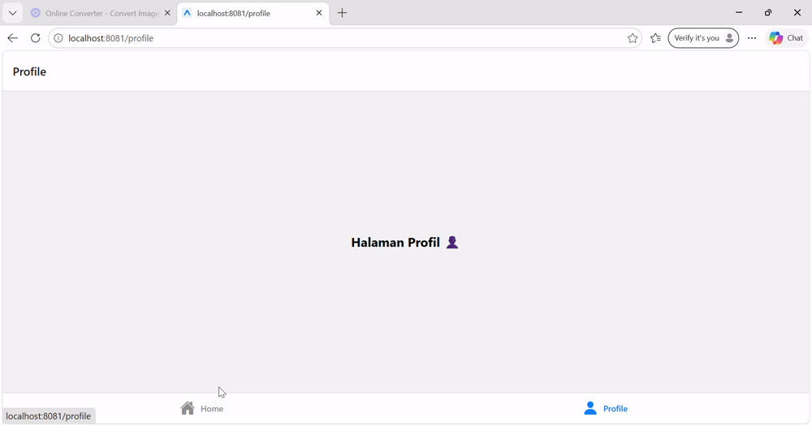
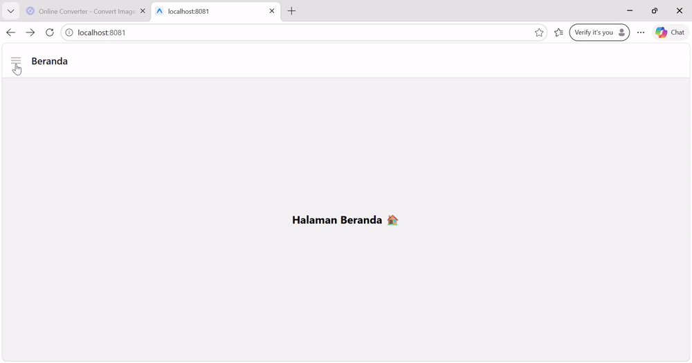

# PRAKTIKUM 4: Navigasi di React Native

## Tujuan Pembelajaran

1. Memahami konsep perpindahan layar (*routing*) pada aplikasi mobile.
2. Melakukan instalasi dan konfigurasi React Navigation.
3. Mengimplementasikan **Stack Navigation**.
4. Mengimplementasikan **Bottom Tab Navigation**.
5. Mengimplementasikan **Drawer Navigation**.

## Persiapan
### Langkah 1: Install Core Navigation Library
Menginstal library utama **React Navigation** yang digunakan untuk mengatur navigasi antar halaman.
[npm install @react-navigation/native]

### Langkah 2: Install Dependensi Pendukung
Menginstal dependensi tambahan yang dibutuhkan agar React Navigation dapat berjalan dengan baik.
[npx expo install react-native-screens react-native-safe-area-context react-native-gesture-handler react-native-reanimated]

---

# PRAKTIKUM 1: Stack Navigation
### Langkah 1: Instalasi Pustaka Stack
Menginstal pustaka **Native Stack Navigator** untuk membuat navigasi antar halaman secara berurutan.
[npm install @react-navigation/native-stack]

### Langkah 2: Membuat File Screen
Membuat halaman **Login** sebagai halaman awal aplikasi.
**File `Login.js`**

Membuat halaman **Signup** sebagai halaman pendaftaran pengguna.
**File `Signup.js`**

### Langkah 3: Uji Coba Stack Navigation
Menjalankan aplikasi dan menguji perpindahan dari halaman Login ke Signup serta kembali ke halaman sebelumnya menggunakan tombol navigasi.
!

---

# PRAKTIKUM 2: Bottom Tab Navigation
### Langkah 1: Instalasi Pustaka Bottom Tabs
Menginstal pustaka **Bottom Tab Navigator** untuk membuat menu navigasi pada bagian bawah aplikasi.

### Langkah 2: Membuat Layar Baru
Membuat halaman **Home** yang akan ditampilkan pada menu Home.
**File `HomeScreen.js`**

Membuat halaman **Profile** yang akan ditampilkan pada menu Profile.
**File `ProfileScreen.js`**

### Langkah 3: Konfigurasi Tab di App.js
Mengatur halaman Home dan Profile ke dalam navigasi tab sehingga pengguna dapat berpindah halaman melalui menu bagian bawah.

---

# PRAKTIKUM 3: Drawer Navigation
### Langkah 1: Instalasi Pustaka Drawer
Menginstal pustaka **Drawer Navigator** untuk membuat menu navigasi berbentuk panel samping.

### Langkah 2: Konfigurasi Drawer di App.js
Mengatur halaman yang akan ditampilkan pada Drawer Navigation dan menjalankan aplikasi untuk menguji menu samping.

---